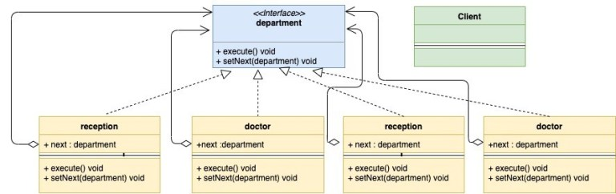
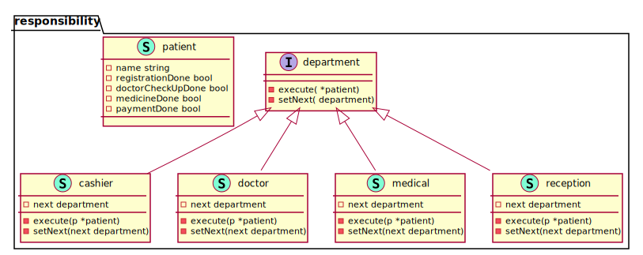

# Chain of Responsibility

Chain of Responsibility Design Pattern is a behavioral design pattern. It lets you create a chain of request handlers. For every incoming request, it is passed through the chain and each of the handler:

- Processes the request or skips the processing.
- Decides whether to pass the request to the next handler in the chain or not
  
When to Use?
- The pattern is applicable when there are multiple candidates to process the same request.
- When you don’t want the client to choose the receiver as multiple objects can handle the request. Also, you want to decouple the client from receivers. The Client only needs to know the first element in the chain.

UML Diagram of example:

<!--  -->
