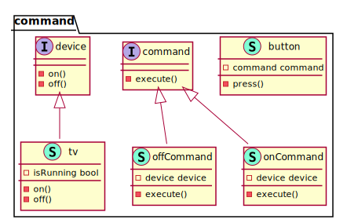

# Command

Command Design Pattern is a behavioral design pattern. It suggests encapsulating the request as a standalone object. The created object has all the information about the request and thus can execute it independently.

The basic components that are used in the command design pattern are:

- Receiver – It is the class which contains the business logic. The command object only delays its requests to the receiver.
- Command – embeds receiver and binds a particular action of the receiver.
- Invoker – It embeds the command and envokes the command by calling the command’s execute method.
- Client – It creates the command with the appropriate receiver bypassing the receiver to the command’s constructor. After that, it also associates the resulting command with an invoker.

UML Diagram

<!--  -->
