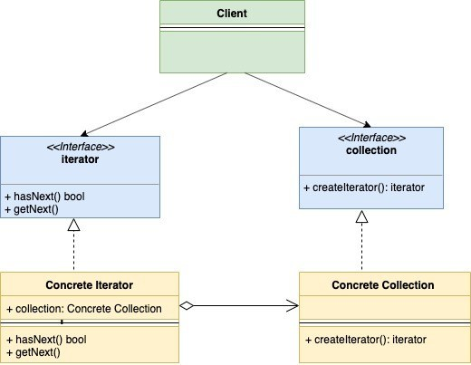

# Iterator

Iterator design pattern is a behavioral design pattern. In this pattern, the collection struct provides an iterator which lets it go through each element in the collection struct in sequence without exposing its underlying implementation.

Below are basic components of the Iterator Design Pattern

- **Iterator Interface**:  this interface provides basic operations such as hasNext(), getNext() etc. These operations as the name suggests lets you traverse a collection, restarting iteration, etc
- **Collection interface**: this interface represents the collection that needs to be traversed. This interface defines a method createIterator() which returns iterator type
- **Concrete Iterator**: the concrete implementation of iterator interface
- **Concrete Collection**: the concrete implementation of Collection interface

UML Diagram:

