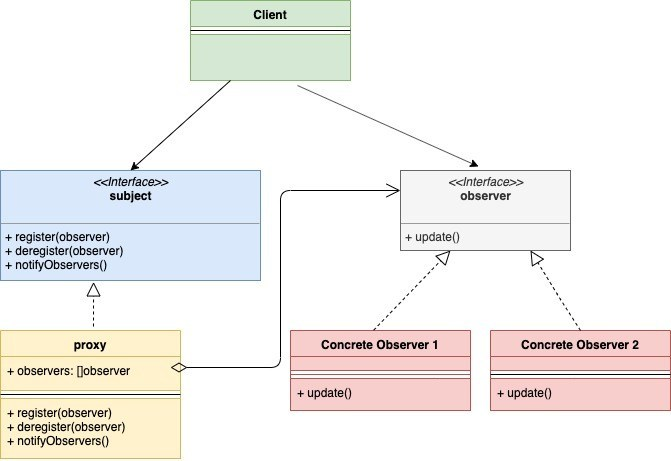

# Observer

Observer Design Pattern is a behavioral design pattern. This pattern allows an instance (called subject) to publish events to other multiple instances (called observers).  These observers subscribe to the subject and hence get notified by events in case of any change happening in the subject.

UML Diagram:

<!--  -->

