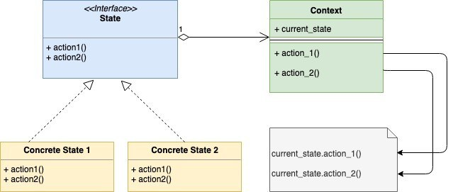
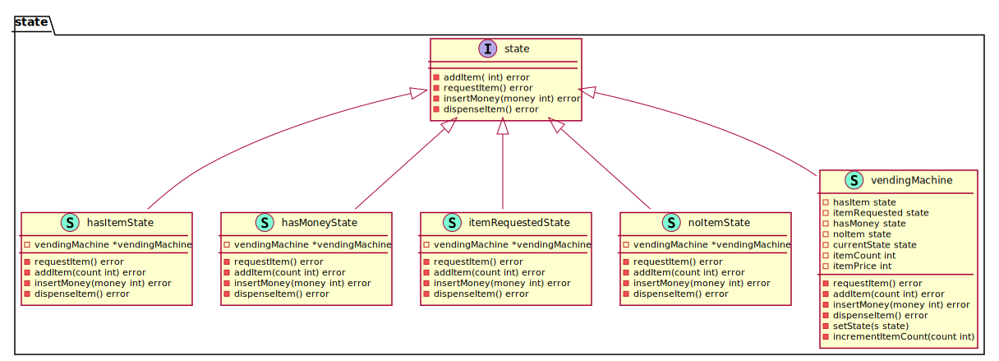

# State

State design pattern is a behavioral design pattern that is based on Finite State Machine. We will explain the State Design Pattern in the context of an example of a Vending Machine. For simplicity, let’s assume that vending machine only has one type of item or product. Also for simplicity lets assume that a Vending Machine can be in 4 different states

- hasItem
- noItem
- itemRequested
- hasMoney
  
A vending machine will also have different actions. Again for simplicity lets assume that there are only four actions:

- Select the item
- Add the item
- Insert Money
- Dispense Item

When To Use?

- Use the State design pattern when the object can be in many different states. Depending upon current request the object needs to change its current state
- Use when an object will have different responses to the same request depending upon the current state. Using state design pattern here will prevent a lot of conditional statements

UML Diagram:

<!--  -->
