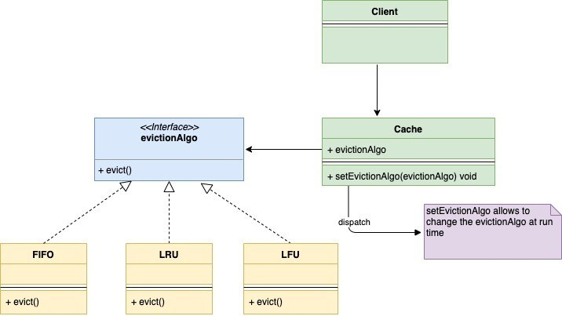

# Strategy

Strategy design pattern is a behavioral design pattern. This design pattern allows you to change the behavior of an object at run time without any change in the class of that object.

Let’s understand the strategy pattern with an example. Suppose you are building an In-Memory-Cache. Since it is an In-Memory-Cache it is of limited size. Whenever it reaches its maximum size that some old entries from the cache need to be evicted. This eviction can happen via several algorithms. Some of the popular algorithms are

- LRU – Least Recently Used: Remove the entry which has been used least recently.
- FIFO – First In First Out: Remove the entry, which was created first.
- LFU – Least Frequently Used: Remove the entry which was least frequently used.

When to Use?
- When an object needs to support different behavior and you want to change the behavior at run time.
- When you want to avoid a lot of conditionals of choosing the runtime behavior.
- When you have different algorithms that are similar and they only differ in the way they execute some behavior.

UML Diagram:
