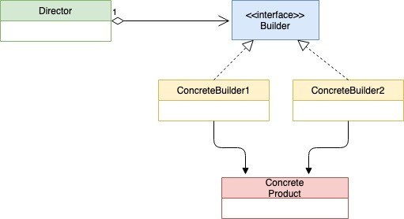
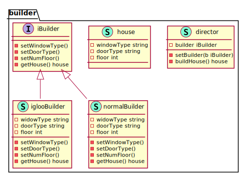

# Builder Pattern

Builder Pattern is a creational design pattern used for constructing complex objects. Below is the UML diagram.

Use Builder pattern when the object constructed is big and requires multiple steps. It helps in less size of the constructor.  The construction of the house becomes simple and it does not require a large constructor

**UML Diagram**

<!--  -->

