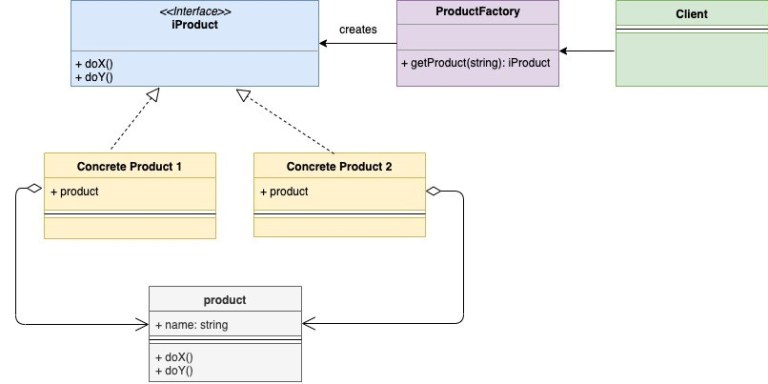
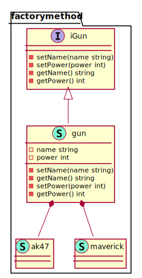

# Factory Method

Factory design pattern is a creational design pattern and it is also one of the most commonly used pattern. This pattern provides a way to hide the creation logic of the instances being created.

**UML Diagram**

<!--  -->
