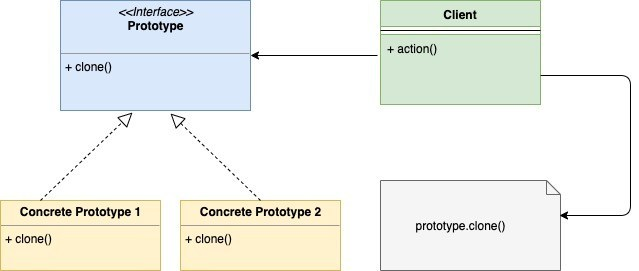

# Prototype

It is a creational design pattern that lets you create copies of objects. In this pattern, the responsibility of creating the clone objects is delegated to the actual object to clone.

The object to be cloned exposes a clone method which returns a clone copy of the object

**UML Diagram**

