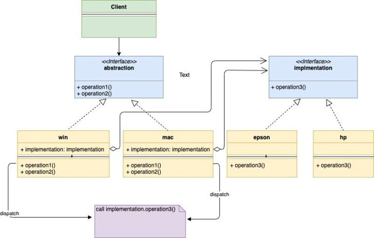

# Bridge

Bridge design pattern is a structural design pattern that allows the separation of abstraction from its implementation. Sounds confusing? Don’t worry, it will be more clear as we go along.

This pattern suggests dividing a large class into two separate hierarchy

- Abstraction – It is an interface and children of the Abstraction are referred to as Refined Abstraction. The abstraction contains a reference to the implementation.
- Implementation – It is also an interface and children’s of the Implementation are referred to as Concrete Implementation
  
UML Diagram:

