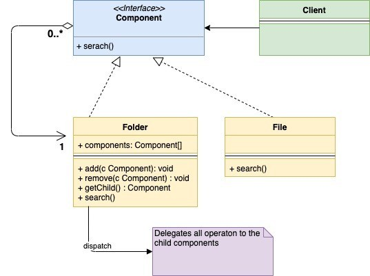
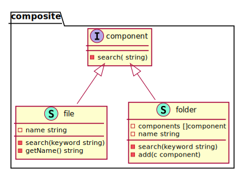

# Composite

This is a structural design pattern. Composition design pattern is used when we want a Group of objects called ‘composite’ is treated in a similar way as a single object. It comes under structural design pattern as it allows you to compose objects into a tree structure. Each of the individual objects in the tree structure can be treated in the same way irrespective of whether they are Complex or Primitive.

When to Use?

- Composite Design pattern makes sense to use in cases when the composite and individual object needs to be treated in the same way from a client perspective.
- Use this pattern when the composite and individual object form a tree-like structure

UML Diagram:

<!--  -->
