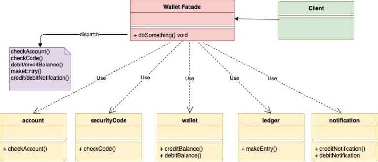

# Facade

Facade Pattern is classified as a structural design pattern. This design pattern is meant to hide the complexities of the underlying system and provide a simple interface to the client. It provides a unified interface to underlying many interfaces in the system so that from the client perspective it is easier to use. Basically it provides a higher level abstraction over a complicated system.

The term Facade itself means

the principal front of a building, that faces on to a street or open space

Only the front face of the building is shown all the underlying complexity is hidden behind.

When to Use?
- When you want to expose a complex system in a simplified way.

UML Diagram:

