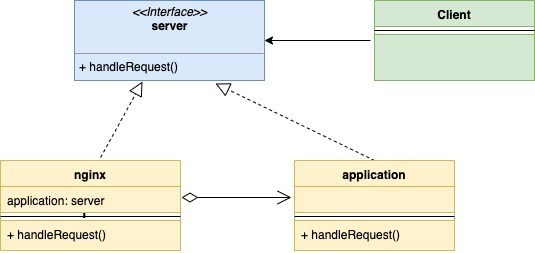
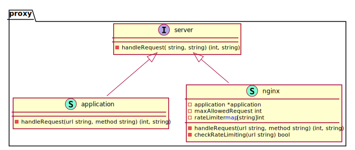

# Proxy

Proxy Design Pattern is a structural design pattern. This pattern suggests providing an extra layer of indirection for controlled and intelligent access to the main object.

In this pattern, a new proxy class is created that implements the same interface as the main object. This lets you execute some behavior before the actual logic of the main object. Let’s understand it more with an example

1. A debit card is a proxy for your bank account. It follows the same interface as the bank account, and it is easier to use.
2. A web server such as Nginx can act as a proxy for your application server. It provides
    - Controlled access to your application server – For example, it can do rate limiting
    - Additional behavior – For example, it can do some caching

UML Diagram:

<!--  -->
